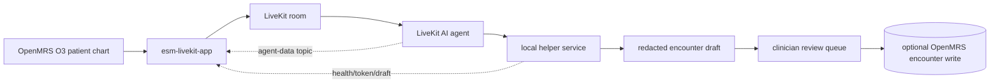

# OpenMRS LiveKit Voice Assistant

<p align="center">
  
  
  
  
  
</p>

OpenMRS LiveKit is a local-first clinical voice assistant for OpenMRS O3. It
opens a patient-scoped LiveKit audio room from the chart, supports a
doctor-patient voice workflow, redacts PHI-like text, and produces a structured
OpenMRS encounter draft for clinician review.

The project is designed for clinics where internet connectivity is unreliable,
privacy matters, and bilingual encounters are common.

## At a Glance

| Area            | Current behavior                                                                                                                                                                |
| --------------- | ------------------------------------------------------------------------------------------------------------------------------------------------------------------------------- |
| Frontend        | OpenMRS O3 microfrontend with Carbon UI, LiveKit room controls, patient context, privacy status, transcript, and draft review.                                                  |
| Helper service  | Local Python service for LiveKit tokens, health/readiness, PHI redaction, synthetic consultations, encounter compilation, draft queueing, and optional OpenMRS writes.          |
| Realtime agent  | Companion repository: [sihsalus/openmrs-livekit](https://github.com/sihsalus/openmrs-livekit). It owns STT, LLM/tool calls, TTS, data-channel events, and OpenMRS draft events. |
| Safety boundary | Assistive documentation only. Drafts are queued for clinician review and are not written to OpenMRS unless explicitly configured and requested.                                 |
| Synthetic data  | Deterministic synthetic consultations for validation and end-to-end checks without real patient data.                                                                           |

## What It Does

- Starts a patient-scoped LiveKit audio room from an OpenMRS O3 extension.
- Derives safe defaults for LiveKit URL, token endpoint, room prefix, and
  clinical language metadata.
- Supports local-first speech-to-text, clinical translation, text-to-speech, and
  encounter drafting through the LiveKit agent and helper service.
- Consumes `agent-data` LiveKit data-channel messages for agent status,
  transcript payloads, clinical facts, and drafts.
- Redacts PHI-like identifiers before generated text is displayed or queued.
- Builds reviewable drafts with chief complaint, symptoms, medications,
  allergies, assessment notes, patient instructions, facts, missing fields, and
  review queue items.
- Avoids storing raw audio by default.
- Queues drafts locally and can optionally write OpenMRS encounter payloads only
  when write mode, credentials, and OpenMRS metadata are configured.

## Architecture



```text
OpenMRS O3 patient chart
  -> LiveKit room
  -> LiveKit AI agent
  -> local helper service
  -> configured model provider or Ollama-compatible drafting
  -> redacted encounter draft
  -> clinician review queue
```

Repository layout:

| Path                           | Purpose                                                                                                                               |
| ------------------------------ | ------------------------------------------------------------------------------------------------------------------------------------- |
| `src/`                         | OpenMRS O3 microfrontend, LiveKit token client, room UI, patient context, agent data parsing, draft review UI, and tests.             |
| `token-server/`                | Local helper service, local AI contracts, synthetic data, redaction, draft queue/write bridge, smoke tests, and e2e contract tests.   |
| `deploy/openmrs-base-livekit/` | Reproducible OpenMRS base stack integration with LiveKit server, CPU agent, helper service, gateway routes, CSP, and frontend config. |
| `translations/`                | English and Spanish UI messages.                                                                                                      |

## AI Model Boundary

The browser frontend does not hardcode or run a foundation model. It connects the
OpenMRS chart to LiveKit, sends room metadata, and consumes agent data-channel
events. Model provider selection belongs to the companion agent and helper
configuration.

Known defaults in this repository:

- Standalone helper `/compile-encounter`: `OLLAMA_MODEL` defaults to
  `medgemma:latest` and falls back to deterministic heuristics when Ollama is not
  reachable.
- OpenMRS base deployment: the helper and CPU agent default
  `OLLAMA_MODEL` to `qwen2.5:1.5b` unless overridden in the deployment
  environment.
- OpenMRS base deployment sets the CPU agent `LLM_PROVIDER=ollama`.

The base agent prompt lives in the companion agent repository. The current
reference configuration targets Spanish clinical encounters in a Latin American
OpenMRS setting and can be replaced by site-specific session instructions in the
agent layer.

## Clinical Safety and Privacy

| Control          | Implementation posture                                                                                          |
| ---------------- | --------------------------------------------------------------------------------------------------------------- |
| Raw audio        | Not stored by default. Recording requires explicit consent workflow and storage controls.                       |
| PHI-like text    | Deterministic redaction for helper-generated text and synthetic identifiers.                                    |
| Drafts           | Clinician-reviewable queue by default, not autonomous charting.                                                 |
| OpenMRS writes   | Disabled by default. Requires explicit write request plus enabled server configuration.                         |
| Audit events     | Draft lifecycle events exclude transcript and draft text; patient references are hashed.                        |
| Local-first mode | Supported for offline-capable deployments through local LiveKit, agent, helper, and Ollama-compatible drafting. |

This project is not a diagnostic system and does not make autonomous clinical
decisions. Generated output must be reviewed by a clinician before charting.

## Quick Start

Install frontend dependencies:

```bash
yarn install
```

Run the OpenMRS frontend:

```bash
yarn start
```

Install and run the local helper:

```bash
python3 -m venv token-server/.venv
token-server/.venv/bin/pip install -r token-server/requirements.txt
LIVEKIT_API_KEY=<key> LIVEKIT_API_SECRET=<secret> token-server/.venv/bin/python token-server/server.py
```

The helper listens on port `7890` by default. When OpenMRS config is left blank,
the frontend derives:

| Setting           | Derived default                               |
| ----------------- | --------------------------------------------- |
| LiveKit WebSocket | `ws(s)://<current-browser-host>:7880`         |
| Token endpoint    | `http(s)://<current-browser-host>:7890/token` |
| Room prefix       | `openmrs-voice-`                              |

For any shared evaluation, staging, or production deployment, enable the
readiness gate and configure browser origins explicitly:

```bash
TOKEN_SERVER_ENV=production
TOKEN_SERVER_ALLOWED_ORIGINS=https://openmrs.example.org
LIVEKIT_API_KEY=<site-livekit-api-key>
LIVEKIT_API_SECRET=<site-livekit-api-secret>
```

Production mode fails fast if LiveKit signing credentials or the CORS allowlist
are missing. The helper also creates local draft, recording manifest, and audit
JSONL files with owner-only permissions (`0600`). That is useful for a
controlled evaluation host, but it is not a substitute for encrypted storage in a
regulated deployment.

## Configuration

The OpenMRS module config schema exposes:

| Config key         | Meaning                                                                                              |
| ------------------ | ---------------------------------------------------------------------------------------------------- |
| `livekitServerUrl` | LiveKit WebSocket URL. Leave blank to derive the browser-host default.                               |
| `tokenEndpoint`    | Helper endpoint used to request LiveKit room tokens. Leave blank to derive the browser-host default. |
| `roomPrefix`       | LiveKit room prefix joined by the local agent. Defaults to `openmrs-voice-`.                         |

At consultation start, the microfrontend derives default clinician, patient, and
agent voice languages from the active OpenMRS locale. English is the default
unless the OpenMRS locale is Spanish (`es`, `es-PE`, `es_MX`, etc.). The user can
adjust the values before the room is created.

The token request sends:

```json
{
  "patientUuid": "aefc6e8d-fdc7-430f-9dae-a1dcbff2cdec",
  "roomName": "openmrs-voice-aefc6e8d-fdc7-430f-9dae-a1dcbff2cdec",
  "roomPrefix": "openmrs-voice-",
  "doctorLanguage": "es",
  "patientLanguage": "en",
  "agentVoiceLanguage": "es",
  "captureRole": "doctor",
  "defaultHumanRole": "doctor",
  "speakerAttributionMode": "source-role"
}
```

The helper normalizes `doctorLanguage`, `patientLanguage`, and
`agentVoiceLanguage` to supported base codes (`en` and `es`). Unsupported patient
languages fall back to the normalized clinician language. If `LIVEKIT_HTTP_URL`
is configured, the helper performs a best-effort LiveKit room metadata sync
before returning the browser token.

The browser microphone is requested as `captureRole=doctor`. If the STT provider
emits a `speaker_id`, the agent can include `speakerId`, attribution mode, and
attribution source in transcript payloads. If no speaker ID is available, the
transcript falls back to the configured default human role instead of claiming
automatic doctor/patient diarization.

## Helper Service Contracts

The helper is not the realtime conversational agent. It provides local contracts
that support the frontend, validation workflows, and smoke tests.

| Endpoint                       | Contract                                                                                                                                   |
| ------------------------------ | ------------------------------------------------------------------------------------------------------------------------------------------ |
| `GET /health`                  | Reports LiveKit, OpenMRS, Ollama, agent, STT/TTS, token signing, CORS, local storage, draft audit, and production readiness status.        |
| `POST /token`                  | Returns an HS256 LiveKit JWT with a room-scoped join grant and optional room metadata sync.                                                |
| `POST /compile-encounter`      | Redacts PHI-like text and compiles a clinician-reviewable OpenMRS draft using Ollama when available or deterministic heuristics otherwise. |
| `POST /synthetic-consultation` | Generates deterministic synthetic dialogue, redacted transcript, draft, and an `openmrsDraftRequest` for validation and e2e tests.         |
| `POST /recording/session`      | Records a consent manifest for future recording workflow; it does not capture or store raw audio by default.                               |
| `POST /openmrs/draft`          | Queues a draft locally by default and can optionally create an OpenMRS encounter through `/openmrs/ws/rest/v1`.                            |

Important helper environment variables:

| Variable                                 | Use                                                                                               |
| ---------------------------------------- | ------------------------------------------------------------------------------------------------- |
| `LIVEKIT_API_KEY`, `LIVEKIT_API_SECRET`  | LiveKit token signing. Missing values fall back to LiveKit dev defaults only in development mode. |
| `LIVEKIT_HTTP_URL`                       | Optional LiveKit HTTP API URL for best-effort room metadata sync.                                 |
| `LIVEKIT_ROOM_PREFIX`                    | Room prefix shared by frontend, helper, and agent.                                                |
| `TOKEN_SERVER_ENV`                       | Set to `production` for shared evaluation and production-like deployments.                        |
| `TOKEN_SERVER_REQUIRE_PRODUCTION_CONFIG` | Enables production readiness checks without changing `TOKEN_SERVER_ENV`.                          |
| `TOKEN_SERVER_ALLOWED_ORIGINS`           | Comma-separated browser origins accepted by CORS. Required for production readiness.              |
| `OLLAMA_MODEL`                           | Model name used by helper `/compile-encounter` when Ollama is available.                          |
| `DRAFT_STORE_PATH`                       | Local JSONL draft queue path.                                                                     |
| `RECORDING_MANIFEST_PATH`                | Local JSONL recording consent manifest path.                                                      |
| `AUDIT_LOG_PATH`                         | Draft lifecycle audit JSONL path.                                                                 |
| `AUDIT_HASH_SALT`                        | Site-managed salt for hashed patient references in audit events.                                  |

Optional OpenMRS write configuration:

```bash
OPENMRS_DRAFT_WRITE_ENABLED=true
OPENMRS_ENCOUNTER_TYPE_UUID=<encounter-type-uuid>
OPENMRS_LOCATION_UUID=<location-uuid>
OPENMRS_DRAFT_OBS_CONCEPT_UUID=<text-concept-uuid-for-ai-draft>
OPENMRS_PROVIDER_UUID=<provider-uuid>
OPENMRS_ENCOUNTER_ROLE_UUID=<encounter-role-uuid>
OPENMRS_STRUCTURED_OBS_CONCEPTS='{"chiefComplaint":"...","symptoms":"...","medicationsMentioned":"...","allergiesMentioned":"...","assessmentNotes":"...","patientInstructions":"..."}'
```

To request a real OpenMRS write, send `writeToOpenmrs: true` or
`mode: "write"`. The server writes only when `OPENMRS_DRAFT_WRITE_ENABLED=true`
and required OpenMRS metadata are configured. Authentication can come from
`OPENMRS_USERNAME` and `OPENMRS_PASSWORD`, `OPENMRS_BASIC_AUTH`, or the forwarded
OpenMRS browser session cookie.

Draft lifecycle audit event types:

- `draft_queued`: draft was queued locally without an OpenMRS write.
- `draft_saved`: OpenMRS accepted the encounter create request.
- `draft_write_rejected`: an OpenMRS write was requested but blocked or rejected
  by configuration, authentication, patient lookup, or the OpenMRS REST API.

## OpenMRS Base Deployment

The reproducible OpenMRS base stack lives in
`deploy/openmrs-base-livekit`. It adds the LiveKit server, CPU agent,
helper/token service, gateway routes, CSP, and frontend module configuration
without committing site secrets.

Set these values in the OpenMRS distro `.env` or export them before running
Docker Compose:

```bash
OPENMRS_DISTRO_ROOT=/path/to/openmrs-distro-referenceapplication
OPENMRS_ESM_LIVEKIT_PATH=/path/to/openmrs-esm-livekit
OPENMRS_LIVEKIT_AGENT_PATH=/path/to/openmrs-livekit
LIVEKIT_HOST=<browser-reachable-host>
OPENMRS_LIVEKIT_SERVER_URL=<optional-browser-wss-livekit-url>
LIVEKIT_API_KEY=<site-livekit-api-key>
LIVEKIT_API_SECRET=<site-livekit-api-secret>
AUDIT_HASH_SALT=<site-managed-random-salt>
OPENMRS_PASSWORD=<openmrs-admin-password>
```

The normal frontend deployment path is npm:

```bash
npm view @sihsalus/esm-livekit-app version
```

Set `OPENMRS_LIVEKIT_FRONTEND_VERSION` only to a version that is actually
published on npm. If a release tag builds successfully but npm publish fails, the
OpenMRS frontend can temporarily serve a locally built `dist/` directory via the
importmap for deployment recovery, but that hotfix is not the long-term
reproducible path.

Install into the OpenMRS distro:

```bash
mkdir -p "$OPENMRS_DISTRO_ROOT/deploy/livekit"
cp deploy/openmrs-base-livekit/*.yml "$OPENMRS_DISTRO_ROOT/deploy/livekit/"
cp deploy/openmrs-base-livekit/*.Dockerfile "$OPENMRS_DISTRO_ROOT/deploy/livekit/"

OPENMRS_DISTRO_ROOT="$OPENMRS_DISTRO_ROOT" \
LIVEKIT_HOST="$LIVEKIT_HOST" \
python3 deploy/openmrs-base-livekit/configure_base_livekit.py
```

Run from the OpenMRS distro root:

```bash
docker compose \
  -f docker-compose.yml \
  -f deploy/livekit/build.yml \
  -f deploy/livekit/livekit.yml \
  up -d --build
```

Verify:

```bash
docker compose ps
curl http://localhost:7890/health
docker logs openmrs-distro-referenceapplication-livekit-helper-1
docker logs openmrs-distro-referenceapplication-livekit-agent-cpu-1
```

For HTTPS deployments, route LiveKit through the gateway WebSocket proxy and use
a browser-trusted hostname:

```bash
SSL_MODE=dev
CERT_WEB_DOMAINS=openmrs.example.org,localhost
CERT_WEB_DOMAIN_COMMON_NAME=openmrs.example.org
OPENMRS_LIVEKIT_SERVER_URL=wss://openmrs.example.org/livekit-sfu
TOKEN_SERVER_ALLOWED_ORIGINS=https://openmrs.example.org,http://openmrs.example.org
```

The deployed bundle should include the OpenMRS base FHIR workaround: it fetches
`MedicationRequest?patient=<uuid>&_count=20` and filters active medication
requests locally instead of sending `status=active` to the base distro FHIR
endpoint.

## Tests

Run the frontend test suite:

```bash
yarn test
```

Run the helper contract tests:

```bash
yarn test:e2e:token-server
```

The helper e2e test starts fake local OpenMRS, Ollama, and LiveKit services, then
validates health checks, PHI redaction, synthetic data generation, recording
consent, CORS, and an authenticated OpenMRS encounter write against the fake REST
API.

Run a smoke test against a real running helper:

```bash
yarn test:smoke:token-server
```

For a remote helper:

```bash
TOKEN_SERVER_SMOKE_URL=https://helper.example.org yarn test:smoke:token-server
```

## End-to-End Smoke Test

This checklist is the minimum bar before presenting the prototype as tested in a
real environment. It complements automated unit and contract tests; it does not
make the project production-ready by itself.

### Automated Helper Smoke

Start the helper with the same environment used by the target deployment:

```bash
LIVEKIT_API_KEY=<key> LIVEKIT_API_SECRET=<secret> python3 token-server/server.py
```

Run:

```bash
yarn test:smoke:token-server
```

The smoke test verifies:

- `/health` reports the `agent-data` data-channel contract.
- `/token` returns an HS256 LiveKit JWT with a room-scoped join grant.
- `/compile-encounter` redacts name, email, phone, local document IDs, and
  OpenMRS ID values.
- `/synthetic-consultation` returns synthetic, redacted consultation data.
- `/openmrs/draft` queues a clinician-reviewed draft without writing to OpenMRS.

### Real Environment Preflight

Use only synthetic patient data. Record these values before the browser smoke:

```text
OpenMRS URL:
LiveKit WebSocket URL:
Token endpoint:
Agent command/container:
Room prefix:
Synthetic patient UUID:
OpenMRS encounter type UUID:
OpenMRS location UUID:
Draft obs concept UUID:
```

Required preflight checks:

1. OpenMRS is served over HTTPS, or every service is localhost-only.
2. `livekitServerUrl` is `wss://` for shared environments.
3. `tokenEndpoint` is `https://` for shared environments.
4. Helper runs with `TOKEN_SERVER_ENV=production` or
   `TOKEN_SERVER_REQUIRE_PRODUCTION_CONFIG=true` for shared evaluations.
5. Helper `/health` shows configured LiveKit token signing and a non-permissive
   CORS allowlist for the OpenMRS browser origin.
6. Frontend `roomPrefix`, helper `LIVEKIT_ROOM_PREFIX`, and agent
   `LIVEKIT_ROOM_PREFIX` match exactly.
7. Agent process is running with the intended STT, LLM, and TTS providers.
8. Browser microphone permission is granted and visible in the browser site
   settings.

### Manual Browser Smoke

1. Open a synthetic patient chart and launch the LiveKit voice panel.
2. Confirm the health panel shows LiveKit, token server, local storage, agent,
   OpenMRS, and draft write readiness.
3. Confirm the agent publishes an `agent_connected` or `agent_listening` status
   on the `agent-data` data-channel topic before the first transcript.
4. Speak this synthetic utterance through the browser microphone:

   ```text
   Paciente: Maria Fernanda Quispe, H.C. A-998877, vive en Av. Los Incas 123.
   Tiene tos seca desde hace cinco dias. Niega alergias a medicamentos.
   Toma paracetamol 500 mg cada ocho horas.
   ```

5. Confirm the live transcript arrives on the `agent-data` data-channel topic.
6. Confirm patient identifiers are redacted before display or draft persistence:
   `Maria Fernanda Quispe`, `A-998877`, and `Av. Los Incas 123` must not appear
   in frontend transcript text, stored evidence snippets, queued draft text, or
   helper logs.
7. Confirm negation is preserved: `niega alergias` must not become a positive
   allergy.
8. Confirm medication and dose are preserved for review:
   `paracetamol 500 mg cada ocho horas`.
9. Confirm the draft shows missing fields and review queue items.
10. Queue the draft and verify no OpenMRS write occurs unless explicitly
    enabled.
11. Confirm the helper writes a `draft_queued`, `draft_saved`, or
    `draft_write_rejected` audit event without transcript or draft text.
12. If write mode is enabled, verify the created encounter uses the expected
    patient, encounter type, location, provider, role, and concept UUIDs.
13. Reload the patient chart and verify the saved or queued draft state is
    explainable to a clinician reviewer.

### Deployment Logs

For the self-hosted stack, use container logs to verify the browser, LiveKit,
helper, and agent path without storing raw clinical audio or transcript text:

```bash
docker logs -f openmrs-distro-referenceapplication-gateway-1
docker logs -f openmrs-distro-referenceapplication-livekit-helper-1
docker logs -f openmrs-distro-referenceapplication-livekit-1
docker logs -f openmrs-distro-referenceapplication-livekit-agent-cpu-1
docker logs -f openmrs-distro-referenceapplication-backend-1
```

Useful signals:

- Gateway: static microfrontend chunks, `/livekit/token`, `/livekit/health`, and
  OpenMRS REST/FHIR status codes.
- Helper: token, health, synthetic consultation, compile, and draft queue
  requests.
- LiveKit: browser participant joins, agent assignment, ICE/UDP connection type,
  track publication, and room close reason.
- Agent: room connection, metadata parsing, prompt budgeting, readiness status,
  TTS/STT/LLM timing, and transcript-save policy.

The expected deployment logging posture is metadata and operational status only.
Helper and agent logs must not include raw transcript text, draft text, or
unredacted patient identifiers.

### Known Weakness Validation

Room metadata validation:

```bash
docker logs openmrs-distro-referenceapplication-livekit-helper-1 \
  | grep -E "LiveKit room metadata (created|updated)"
docker logs openmrs-distro-referenceapplication-livekit-agent-cpu-1 \
  | grep -E "Metadata parsed|Room metadata derived from room name|Room metadata empty|Sending initial greeting"
```

Expected result:

- Helper logs `LiveKit room metadata created` or `updated` for rooms opened from
  the OpenMRS microfrontend when `LIVEKIT_HTTP_URL` is configured.
- Agent logs `Metadata parsed` when LiveKit room metadata is available.
- The helper room metadata includes normalized `doctorLanguage`,
  `patientLanguage`, `agentVoiceLanguage`, `languageMode`,
  `speakerAttributionMode`, and `defaultHumanRole`.
- English is the expected default when OpenMRS does not expose a Spanish locale.
  Spanish OpenMRS locales such as `es`, `es-PE`, or `es_MX` should produce
  Spanish room metadata.
- The agent uses `doctorLanguage` for STT language hints, `agentVoiceLanguage`
  for the initial greeting and assistant transcript language labels, and
  `patientLanguage` for patient-facing translation context.
- Agent may log `Room metadata derived from room name` as a non-blocking
  fallback for rooms named with the configured prefix, for example
  `openmrs-voice-<patientUuid>`.
- `Room metadata empty` should only appear for rooms that do not match the
  configured agent room prefix or cannot expose a patient UUID safely.
- Transcript payloads should include `speakerId` and
  `attributionMode=stt-speaker-id` when the STT provider emits speaker IDs. If
  no speaker ID is available, the payload should include
  `attributionSource=missing-speaker-id` and fall back to `defaultHumanRole`.
  That fallback is intentionally not presented as automatic diarization.

OpenMRS base FHIR MedicationRequest validation:

```bash
curl -I "$OPENMRS_BASE_URL/ws/fhir2/R4/MedicationRequest?patient=<uuid>&_count=20"
curl -I "$OPENMRS_BASE_URL/ws/fhir2/R4/MedicationRequest?patient=<uuid>&status=active&_count=20"
```

Expected result:

- The first request should return `200`.
- On the observed OpenMRS base distro with `fhir2-api-4.1.0`, the second request
  can return `500` due to a backend `NullPointerException`.
- The microfrontend avoids that backend bug by fetching MedicationRequest
  without the `status` search parameter and filtering `status === "active"`
  locally.

### Go / No-Go Criteria

Ready for supervised evaluation only if all are true:

- Browser joins the room without mixed-content errors.
- Microphone publishes audio and the agent receives it.
- Agent publishes readiness status over `agent-data`.
- At least one transcript and one draft arrive in the frontend.
- Synthetic identifiers are redacted before display or persistence.
- Draft remains reviewable and does not write to OpenMRS unless explicitly
  enabled.
- Draft lifecycle audit events are present and exclude raw transcript/draft
  content.
- If OpenMRS write is enabled, the encounter appears under the synthetic patient
  with the configured metadata and concept UUIDs.

No-go if any are true:

- Browser requires cleartext `ws://` or `http://` outside localhost.
- Token server accepts an unexpected browser origin in shared environments.
- Agent joins a different room prefix than the frontend.
- Raw synthetic identifiers appear in transcript, draft, logs, or JSONL queues.
- Audit JSONL events contain transcript text or draft text.
- `niega alergias` becomes a positive allergy.
- OpenMRS write occurs without explicit operator action and configuration.

### Not Covered

- Browser-to-agent media quality across real clinic networks.
- LiveKit SFU TLS termination and certificate rotation.
- Application-level end-to-end media encryption.
- Encryption at rest for queued drafts, transcripts, logs, or recording
  manifests.
- Full OpenMRS role-based access review.
- Clinical validation by a clinician.
- Local clinical NER with site dictionaries. Current redaction is deterministic
  pattern matching with local Spanish healthcare identifiers.

## Competitive Review

This review covers adjacent open-source medical scribe projects. It is a
technical positioning exercise, not a claim that any project has been clinically
validated or is production-ready for regulated care without site-specific
security, privacy, and clinical governance review.

OpenMRS LiveKit is not trying to become a generic commercial ambient scribe. Its
specific product wedge is:

```text
OpenMRS O3 patient chart
  -> LiveKit realtime room
  -> local-first AI workflow
  -> PHI-like redaction
  -> evidence-backed encounter draft
  -> clinician review before OpenMRS write
```

Snapshot reviewed on 2026-07-06:

| Project                                                                   | License    | Competitive assessment                                                                                                                                          | Relevance to OpenMRS LiveKit                                                                                                |
| ------------------------------------------------------------------------- | ---------- | --------------------------------------------------------------------------------------------------------------------------------------------------------------- | --------------------------------------------------------------------------------------------------------------------------- |
| [Berta AI Scribe](https://github.com/phairlab/berta-ai-scribe)            | Apache 2.0 | Strong deployment benchmark: FastAPI + Next.js, auth, local/cloud models, storage options, AWS path, and security posture. It is not OpenMRS-first.             | Reuse deployment, auth, storage, and operations patterns. Avoid copying product scope wholesale.                            |
| [Open Medical Scribe](https://github.com/BirgerMoell/open-medical-scribe) | MIT        | Strong modular product benchmark: swappable STT/LLM providers, local/cloud/hybrid operation, streaming, FHIR DocumentReference export, and multiple note types. | Reuse provider interfaces, audit events, local/cloud switching, note-quality workflows, and future FHIR export ideas.       |
| [scribeHC](https://github.com/trevorpfiz/scribeHC)                        | MIT        | Useful workflow benchmark: Expo mobile capture, Next.js dashboard, FastAPI processing, authentication, and SOAP note editing. It is a parallel app workflow.    | Use as a UX reference for recording, queue review, and editing. Keep this project embedded in the OpenMRS O3 patient chart. |
| [AI-Scribe](https://github.com/1984Doc/AI-Scribe)                         | GPL-3.0    | Useful local-first reference: Python client/server, Whisper/Kobold-style processing, PHI scrubbing additions, and single-machine setup. Less modular.           | Reference local processing patterns and failure modes only. Do not copy GPL-3.0 code into this MPL-2.0 repository.          |

Positioning conclusion:

- Berta AI Scribe and Open Medical Scribe are credible technical benchmarks.
- Open Medical Scribe is the strongest source of reusable product architecture
  ideas, especially provider boundaries, note formats, and FHIR export.
- Berta AI Scribe is the stronger deployment and operations benchmark.
- scribeHC is useful for mobile capture and dashboard workflow patterns, but is
  not as close to the OpenMRS O3 embedded use case.
- AI-Scribe validates demand for local-first scribing, but is not a direct
  architecture target for this codebase.

Adopted now:

- Keep the current OpenMRS O3 frontend and LiveKit agent architecture.
- Keep local-first provider configuration instead of depending on one hosted
  model.
- Add helper-side draft lifecycle audit events for `draft_queued`,
  `draft_saved`, and `draft_write_rejected`.
- Keep audit events minimal: no transcript text, no draft text, and only hashed
  patient references.
- Keep the clinical safety claim narrow: assistive documentation with clinician
  review, not diagnosis or autonomous charting.

Later product work:

- Add a formal note-quality evaluation rubric, such as PDQI-9-style review, for
  clinician scoring of generated drafts.
- Add specialty-specific templates and OpenMRS concept mapping packs.
- Add local clinical NER with site dictionaries and a labeled Spanish PHI test
  corpus.
- Add encrypted storage and immutable audit storage for regulated deployments.
- Add optional FHIR export where OpenMRS implementations prefer FHIR resources
  over REST encounter payloads.

## Clinical Use Case

The primary use case is point-of-care voice support inside the OpenMRS O3
patient chart. The system can run with local AI services, generate synthetic
bilingual consultations for validation, redact patient identifiers, and produce
a reviewable OpenMRS encounter draft.

The product focus is offline-capable clinical documentation assistance:
clinician-controlled audio capture, translation support, PHI-aware transcript
handling, evidence-backed drafts, and explicit review before any OpenMRS write.
